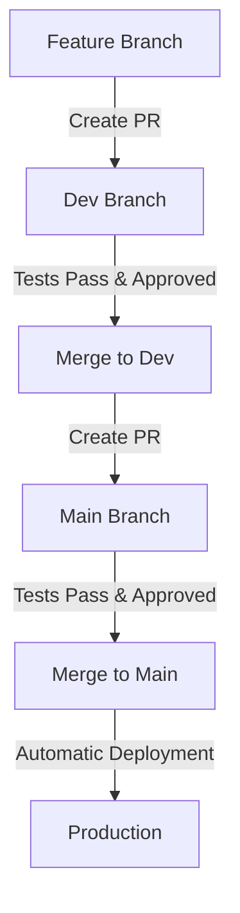

# Feature Branch Workflow

This document outlines the feature branch workflow for development and deployment.

## Workflow Overview



## Step-by-Step Process

### 1. Create Feature Branch

```bash
# Start from the dev branch
git checkout dev
git pull origin dev

# Create a new feature branch
git checkout -b feature/your-feature-name
```

### 2. Develop and Test

- Implement your feature
- Write tests
- Run linting, type checking, and tests locally
- Commit your changes with meaningful commit messages

```bash
# Run linting
npm run lint

# Run type checking
npm run type-check

# Run tests
npm run test

# Commit changes
git add .
git commit -m "feat: add your feature description"
```

### 3. Push Feature Branch and Create Pull Request

```bash
# Push your feature branch
git push origin feature/your-feature-name
```

- Go to GitHub and create a pull request to merge your feature branch into `dev`
- Fill out the pull request template
- Request reviews from team members

### 4. Review and Merge to Dev

- CI will automatically run tests, linting, and type checking
- Address any feedback from reviewers
- Once approved and all checks pass, merge the pull request into `dev`

### 5. Test on Dev

- Verify that your feature works correctly on the dev environment
- Fix any issues that arise

### 6. Create Pull Request to Main

- Create a pull request to merge `dev` into `main`
- Fill out the pull request template
- Request reviews from team members

### 7. Review and Merge to Main

- CI will automatically run tests, linting, and type checking
- Address any feedback from reviewers
- Once approved and all checks pass, merge the pull request into `main`

### 8. Automatic Deployment

- The CI/CD pipeline will automatically deploy the changes to production
- Verify that your feature works correctly in production
- Monitor for any issues
