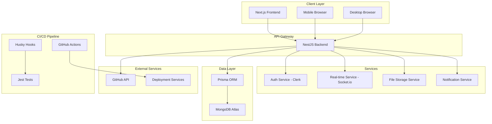
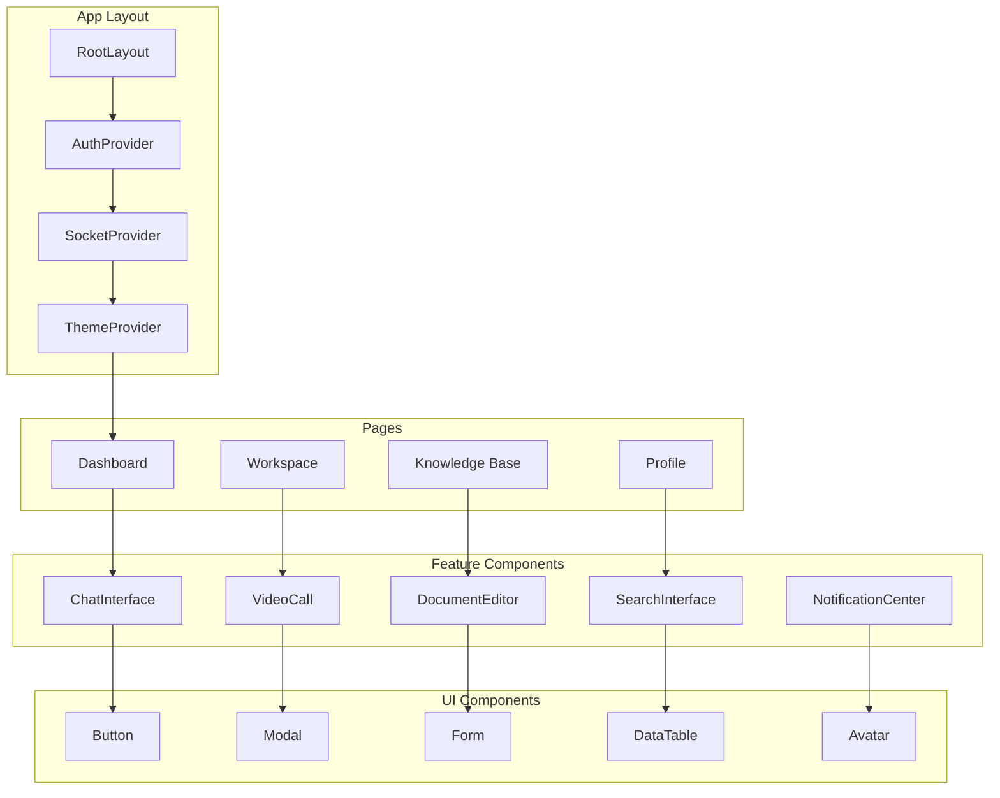
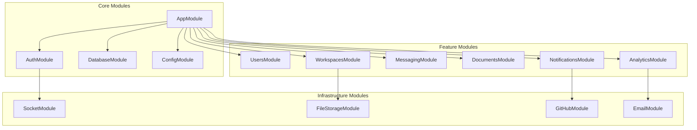
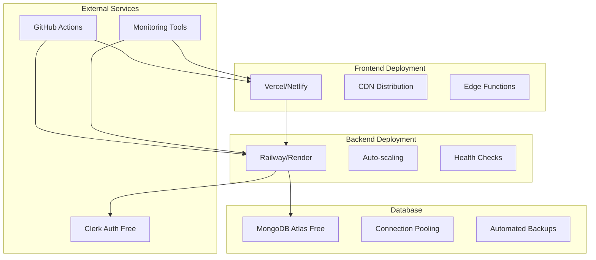

# Design Document

## Overview

La plataforma de comunicación interna y base de conocimientos será una aplicación web full-stack que utiliza una arquitectura de microservicios separada entre frontend y backend. El sistema está diseñado para ser escalable, mantenible y completamente gratuito, utilizando tecnologías modernas que permiten desarrollo rápido y deployment automático.

### Architecture Philosophy

- **Separation of Concerns**: Frontend y backend completamente desacoplados
- **API-First**: Backend expone APIs RESTful para máxima flexibilidad
- **Real-time Communication**: WebSockets para chat y notificaciones en tiempo real
- **Progressive Enhancement**: Funcionalidad básica sin JavaScript, mejorada con interactividad
- **Mobile-First**: Diseño responsive que prioriza la experiencia móvil

## Architecture

### High-Level Architecture



### Technology Stack Integration

**Frontend Stack:**

- **Next.js 14+**: App Router para routing moderno y Server Components
- **Tailwind CSS**: Utility-first styling con configuración personalizada
- **Shadcn UI**: Componentes pre-construidos y accesibles
- **Zustand**: Estado global ligero y TypeScript-friendly
- **Socket.io Client**: Comunicación en tiempo real

**Backend Stack:**

- **NestJS**: Framework modular con decoradores y dependency injection
- **Prisma**: Type-safe database client con migraciones automáticas
- **MongoDB Atlas**: Base de datos NoSQL en la nube (tier gratuito)
- **Socket.io**: WebSocket server para tiempo real
- **Clerk**: Autenticación y gestión de usuarios

## Components and Interfaces

### Frontend Components Architecture



### Backend Modules Architecture



### API Interface Design

**RESTful Endpoints:**

```typescript
// Authentication (handled by Clerk)
POST /api/auth/webhook          // Clerk webhook for user sync

// Users
GET    /api/users               // Get all users
GET    /api/users/:id           // Get user by ID
PUT    /api/users/:id           // Update user profile
DELETE /api/users/:id           // Delete user

// Workspaces
GET    /api/workspaces          // Get user workspaces
POST   /api/workspaces          // Create workspace
GET    /api/workspaces/:id      // Get workspace details
PUT    /api/workspaces/:id      // Update workspace
DELETE /api/workspaces/:id      // Delete workspace

// Channels
GET    /api/workspaces/:id/channels     // Get workspace channels
POST   /api/workspaces/:id/channels     // Create channel
PUT    /api/channels/:id                // Update channel
DELETE /api/channels/:id                // Delete channel

// Messages
GET    /api/channels/:id/messages       // Get channel messages
POST   /api/channels/:id/messages       // Send message
PUT    /api/messages/:id                // Edit message
DELETE /api/messages/:id                // Delete message

// Documents
GET    /api/documents           // Get documents
POST   /api/documents           // Create document
GET    /api/documents/:id       // Get document
PUT    /api/documents/:id       // Update document
DELETE /api/documents/:id       // Delete document
GET    /api/documents/search    // Search documents

// Video Calls
POST   /api/calls               // Start video call
GET    /api/calls/:id           // Get call details
PUT    /api/calls/:id           // Update call status
DELETE /api/calls/:id           // End call

// Analytics
GET    /api/analytics/workspace/:id     // Workspace analytics
GET    /api/analytics/user/:id          // User analytics
```

**WebSocket Events:**

```typescript
// Client to Server
'join-workspace'; // Join workspace room
'leave-workspace'; // Leave workspace room
'send-message'; // Send chat message
'typing-start'; // Start typing indicator
'typing-stop'; // Stop typing indicator
'call-invite'; // Invite to video call
'call-accept'; // Accept video call
'call-reject'; // Reject video call

// Server to Client
'message-received'; // New message received
'user-joined'; // User joined workspace
'user-left'; // User left workspace
'typing-indicator'; // Someone is typing
'call-invitation'; // Incoming call invitation
'call-started'; // Call started
'call-ended'; // Call ended
'notification'; // General notification
```

## Data Models

### Database Schema Design

```typescript
// User Model (synced from Clerk)
interface User {
  id: string; // Clerk user ID
  email: string;
  firstName: string;
  lastName: string;
  imageUrl?: string;
  status: 'online' | 'away' | 'busy' | 'offline';
  lastSeen: Date;
  preferences: UserPreferences;
  createdAt: Date;
  updatedAt: Date;
}

interface UserPreferences {
  notifications: {
    email: boolean;
    push: boolean;
    mentions: boolean;
    directMessages: boolean;
  };
  workingHours: {
    start: string; // "09:00"
    end: string; // "17:00"
    timezone: string;
    daysOfWeek: number[]; // [1,2,3,4,5] for Mon-Fri
  };
  theme: 'light' | 'dark' | 'system';
}

// Workspace Model
interface Workspace {
  id: string;
  name: string;
  description?: string;
  imageUrl?: string;
  ownerId: string;
  members: WorkspaceMember[];
  channels: Channel[];
  settings: WorkspaceSettings;
  createdAt: Date;
  updatedAt: Date;
}

interface WorkspaceMember {
  userId: string;
  role: 'owner' | 'admin' | 'member';
  joinedAt: Date;
}

interface WorkspaceSettings {
  isPublic: boolean;
  allowInvites: boolean;
  retentionDays: number;
}

// Channel Model
interface Channel {
  id: string;
  workspaceId: string;
  name: string;
  description?: string;
  type: 'text' | 'voice' | 'announcement';
  isPrivate: boolean;
  members: string[]; // User IDs
  createdBy: string;
  createdAt: Date;
  updatedAt: Date;
}

// Message Model
interface Message {
  id: string;
  channelId: string;
  userId: string;
  content: string;
  type: 'text' | 'file' | 'image' | 'system';
  attachments?: Attachment[];
  mentions: string[]; // User IDs
  reactions: Reaction[];
  threadId?: string; // For threaded replies
  editedAt?: Date;
  createdAt: Date;
}

interface Attachment {
  id: string;
  filename: string;
  url: string;
  size: number;
  mimeType: string;
}

interface Reaction {
  emoji: string;
  userIds: string[];
  count: number;
}

// Document Model
interface Document {
  id: string;
  workspaceId: string;
  title: string;
  content: string; // Rich text JSON
  tags: string[];
  authorId: string;
  collaborators: string[]; // User IDs
  version: number;
  versions: DocumentVersion[];
  isPublished: boolean;
  viewCount: number;
  lastViewedBy: Record<string, Date>; // userId -> lastViewed
  createdAt: Date;
  updatedAt: Date;
}

interface DocumentVersion {
  version: number;
  content: string;
  authorId: string;
  changes: string; // Description of changes
  createdAt: Date;
}

// Video Call Model
interface VideoCall {
  id: string;
  workspaceId: string;
  channelId?: string;
  title: string;
  hostId: string;
  participants: CallParticipant[];
  status: 'scheduled' | 'active' | 'ended';
  startTime: Date;
  endTime?: Date;
  recordingUrl?: string;
  createdAt: Date;
}

interface CallParticipant {
  userId: string;
  joinedAt?: Date;
  leftAt?: Date;
  role: 'host' | 'participant';
}

// Notification Model
interface Notification {
  id: string;
  userId: string;
  type: 'mention' | 'direct_message' | 'call_invite' | 'document_share' | 'system';
  title: string;
  message: string;
  data: Record<string, any>; // Additional context
  isRead: boolean;
  createdAt: Date;
}
```

### State Management (Zustand)

```typescript
// Auth Store
interface AuthState {
  user: User | null;
  isLoading: boolean;
  setUser: (user: User | null) => void;
  updateUserStatus: (status: User['status']) => void;
}

// Workspace Store
interface WorkspaceState {
  currentWorkspace: Workspace | null;
  workspaces: Workspace[];
  setCurrentWorkspace: (workspace: Workspace) => void;
  addWorkspace: (workspace: Workspace) => void;
  updateWorkspace: (id: string, updates: Partial<Workspace>) => void;
}

// Chat Store
interface ChatState {
  messages: Record<string, Message[]>; // channelId -> messages
  activeChannel: string | null;
  typingUsers: Record<string, string[]>; // channelId -> userIds
  addMessage: (channelId: string, message: Message) => void;
  setActiveChannel: (channelId: string) => void;
  setTypingUsers: (channelId: string, userIds: string[]) => void;
}

// UI Store
interface UIState {
  sidebarOpen: boolean;
  theme: 'light' | 'dark' | 'system';
  notifications: Notification[];
  toggleSidebar: () => void;
  setTheme: (theme: UIState['theme']) => void;
  addNotification: (notification: Notification) => void;
  markNotificationRead: (id: string) => void;
}
```

## Error Handling

### Frontend Error Handling

```typescript
// Error Boundary Component
class ErrorBoundary extends React.Component {
  // Catches JavaScript errors in component tree
  // Shows fallback UI and logs errors
}

// API Error Handling
interface APIError {
  status: number;
  message: string;
  code: string;
  details?: any;
}

// Error Types
enum ErrorCodes {
  UNAUTHORIZED = 'UNAUTHORIZED',
  FORBIDDEN = 'FORBIDDEN',
  NOT_FOUND = 'NOT_FOUND',
  VALIDATION_ERROR = 'VALIDATION_ERROR',
  RATE_LIMITED = 'RATE_LIMITED',
  SERVER_ERROR = 'SERVER_ERROR',
  NETWORK_ERROR = 'NETWORK_ERROR',
}

// Error Handling Utilities
const handleAPIError = (error: APIError) => {
  switch (error.code) {
    case ErrorCodes.UNAUTHORIZED:
      // Redirect to login
      break;
    case ErrorCodes.VALIDATION_ERROR:
      // Show form validation errors
      break;
    case ErrorCodes.NETWORK_ERROR:
      // Show offline indicator
      break;
    default:
    // Show generic error toast
  }
};
```

### Backend Error Handling

```typescript
// Global Exception Filter
@Catch()
export class GlobalExceptionFilter implements ExceptionFilter {
  catch(exception: unknown, host: ArgumentsHost) {
    // Log error
    // Format response
    // Return appropriate HTTP status
  }
}

// Custom Exceptions
export class WorkspaceNotFoundException extends NotFoundException {
  constructor(workspaceId: string) {
    super(`Workspace with ID ${workspaceId} not found`);
  }
}

export class InsufficientPermissionsException extends ForbiddenException {
  constructor(action: string) {
    super(`Insufficient permissions to ${action}`);
  }
}

// Validation Pipes
@Injectable()
export class ValidationPipe implements PipeTransform {
  transform(value: any, metadata: ArgumentMetadata) {
    // Validate input using class-validator
    // Transform data types
    // Return validated data or throw ValidationException
  }
}
```

### Real-time Error Handling

```typescript
// Socket Error Handling
socket.on('error', error => {
  console.error('Socket error:', error);
  // Attempt reconnection
  // Show connection status to user
  // Queue messages for retry
});

// Connection Recovery
const reconnectWithBackoff = (attempt = 1) => {
  const delay = Math.min(1000 * Math.pow(2, attempt), 30000);
  setTimeout(() => {
    socket.connect();
  }, delay);
};
```

## Testing Strategy

### Frontend Testing

```typescript
// Unit Tests (Jest + React Testing Library)
describe('ChatMessage Component', () => {
  it('renders message content correctly', () => {
    // Test component rendering
  });

  it('handles message editing', () => {
    // Test user interactions
  });

  it('displays reactions properly', () => {
    // Test reaction display
  });
});

// Integration Tests
describe('Chat Integration', () => {
  it('sends and receives messages', async () => {
    // Test full chat flow
  });

  it('handles real-time updates', async () => {
    // Test WebSocket integration
  });
});

// E2E Tests (Playwright)
test('user can join workspace and send message', async ({ page }) => {
  // Test complete user journey
});
```

### Backend Testing

```typescript
// Unit Tests
describe('MessageService', () => {
  it('creates message successfully', async () => {
    // Test service methods
  });

  it('validates message content', async () => {
    // Test validation logic
  });
});

// Integration Tests
describe('Messages API', () => {
  it('POST /api/channels/:id/messages', async () => {
    // Test API endpoints
  });

  it('handles authentication', async () => {
    // Test auth middleware
  });
});

// Socket Tests
describe('Chat Socket', () => {
  it('broadcasts messages to channel members', async () => {
    // Test WebSocket events
  });
});
```

### CI/CD Testing Pipeline

```yaml
# .github/workflows/test.yml
name: Test Pipeline
on: [push, pull_request]

jobs:
  frontend-tests:
    runs-on: ubuntu-latest
    steps:
      - uses: actions/checkout@v3
      - uses: actions/setup-node@v3
      - run: npm ci
      - run: npm run test:frontend
      - run: npm run test:e2e

  backend-tests:
    runs-on: ubuntu-latest
    steps:
      - uses: actions/checkout@v3
      - uses: actions/setup-node@v3
      - run: npm ci
      - run: npm run test:backend
      - run: npm run test:integration
```

### Performance Testing

```typescript
// Load Testing Strategy
- Concurrent user simulation (100+ users)
- Message throughput testing
- Database query performance
- WebSocket connection limits
- Memory usage monitoring

// Monitoring & Metrics
- Response time tracking
- Error rate monitoring
- User engagement metrics
- System resource usage
- Real-time connection health
```

## Code Standards and Organization

### Code Quality Principles

**DRY (Don't Repeat Yourself)**

```typescript
// ❌ Repetitive code
const validateEmail = (email: string) => /^[^\s@]+@[^\s@]+\.[^\s@]+$/.test(email);
const validateUserEmail = (email: string) => /^[^\s@]+@[^\s@]+\.[^\s@]+$/.test(email);

// ✅ DRY approach
// utils/validation.ts
export const validateEmail = (email: string) => /^[^\s@]+@[^\s@]+\.[^\s@]+$/.test(email);
```

**SRP (Single Responsibility Principle)**

```typescript
// ❌ Multiple responsibilities
class UserService {
  createUser() {
    /* user creation */
  }
  sendEmail() {
    /* email sending */
  }
  validateData() {
    /* data validation */
  }
}

// ✅ Single responsibility
class UserService {
  createUser() {
    /* only user creation */
  }
}
class EmailService {
  sendEmail() {
    /* only email sending */
  }
}
class ValidationService {
  validateData() {
    /* only data validation */
  }
}
```

### File Organization Structure

```
src/
├── types/
│   ├── index.ts          # Barrel export
│   ├── user.types.ts     # User-related interfaces
│   ├── workspace.types.ts # Workspace interfaces
│   └── api.types.ts      # API response interfaces
├── interfaces/
│   ├── index.ts          # Barrel export
│   ├── services.interface.ts
│   └── repositories.interface.ts
├── utils/
│   ├── index.ts          # Barrel export
│   ├── validation.helpers.ts
│   ├── formatting.helpers.ts
│   └── api.helpers.ts
├── components/
│   ├── index.ts          # Barrel export
│   ├── ui/
│   │   ├── index.ts      # UI components barrel
│   │   ├── Button/
│   │   └── Modal/
│   └── features/
│       ├── index.ts      # Feature components barrel
│       ├── Chat/
│       └── Workspace/
```

### Generic Helper Functions

```typescript
// utils/api.helpers.ts
export const createApiResponse = <T>(
  data: T,
  message: string = 'Success',
  status: number = 200
): ApiResponse<T> => ({
  data,
  message,
  status,
  timestamp: new Date().toISOString(),
});

// utils/validation.helpers.ts
export const validateRequired = <T>(value: T, fieldName: string): ValidationResult => ({
  isValid: value !== null && value !== undefined && value !== '',
  error: value ? null : `${fieldName} is required`,
});

// utils/formatting.helpers.ts
export const formatDate = (date: Date, format: 'short' | 'long' | 'time' = 'short'): string => {
  const options: Intl.DateTimeFormatOptions = {
    short: { month: 'short', day: 'numeric' },
    long: { year: 'numeric', month: 'long', day: 'numeric' },
    time: { hour: '2-digit', minute: '2-digit' },
  }[format];

  return new Intl.DateTimeFormat('en-US', options).format(date);
};
```

### TypeScript Interface Organization

```typescript
// types/user.types.ts
export interface User {
  id: string;
  email: string;
  firstName: string;
  lastName: string;
  imageUrl?: string;
  status: UserStatus;
  preferences: UserPreferences;
  createdAt: Date;
  updatedAt: Date;
}

export interface UserPreferences {
  notifications: NotificationSettings;
  workingHours: WorkingHours;
  theme: ThemeMode;
}

export interface NotificationSettings {
  email: boolean;
  push: boolean;
  mentions: boolean;
  directMessages: boolean;
}

export type UserStatus = 'online' | 'away' | 'busy' | 'offline';
export type ThemeMode = 'light' | 'dark' | 'system';

// types/api.types.ts
export interface ApiResponse<T> {
  data: T;
  message: string;
  status: number;
  timestamp: string;
}

export interface PaginatedResponse<T> extends ApiResponse<T[]> {
  pagination: {
    page: number;
    limit: number;
    total: number;
    totalPages: number;
  };
}

export interface ErrorResponse {
  error: {
    code: string;
    message: string;
    details?: any;
  };
  timestamp: string;
}

// types/index.ts (Barrel export)
export * from './user.types';
export * from './workspace.types';
export * from './message.types';
export * from './document.types';
export * from './api.types';
```

### Barrel Export Pattern

```typescript
// components/index.ts
export { default as Button } from './ui/Button';
export { default as Modal } from './ui/Modal';
export { default as ChatInterface } from './features/Chat';
export { default as WorkspaceSelector } from './features/Workspace';

// utils/index.ts
export * from './validation.helpers';
export * from './formatting.helpers';
export * from './api.helpers';

// Usage
import { Button, Modal, validateEmail, formatDate } from '@/components';
import { User, ApiResponse } from '@/types';
```

### Component Structure Standards

```typescript
// components/features/Chat/ChatMessage.tsx
interface ChatMessageProps {
  message: Message;
  currentUser: User;
  onEdit?: (messageId: string, content: string) => void;
  onDelete?: (messageId: string) => void;
}

export const ChatMessage: React.FC<ChatMessageProps> = ({
  message,
  currentUser,
  onEdit,
  onDelete,
}) => {
  // Component logic
};

// Barrel export in components/features/Chat/index.ts
export { ChatMessage } from './ChatMessage';
export { ChatInput } from './ChatInput';
export { ChatInterface } from './ChatInterface';
```

### Service Layer Organization

```typescript
// services/base.service.ts
export abstract class BaseService<T> {
  protected abstract repository: Repository<T>;

  async findById(id: string): Promise<T | null> {
    return this.repository.findById(id);
  }

  async create(data: Partial<T>): Promise<T> {
    return this.repository.create(data);
  }
}

// services/user.service.ts
@Injectable()
export class UserService extends BaseService<User> {
  constructor(
    @InjectRepository(User)
    protected repository: Repository<User>,
    private emailService: EmailService
  ) {
    super();
  }

  async createUser(userData: CreateUserDto): Promise<User> {
    const user = await this.create(userData);
    await this.emailService.sendWelcomeEmail(user.email);
    return user;
  }
}
```

### Naming Conventions

```typescript
// Files: kebab-case
user - service.ts;
chat - interface.component.tsx;
validation.helpers.ts;

// Interfaces/Types: PascalCase
interface UserPreferences {}
type ApiResponse<T> = {};

// Functions/Variables: camelCase
const validateEmail = () => {};
const currentUser = {};

// Constants: SCREAMING_SNAKE_CASE
const API_BASE_URL = '';
const MAX_FILE_SIZE = 1024;

// Components: PascalCase
const ChatMessage = () => {};
const UserProfile = () => {};
```

## Security Considerations

### Authentication & Authorization

```typescript
// Clerk Integration
- JWT token validation
- Role-based access control (RBAC)
- Session management
- Multi-factor authentication support

// API Security
- Rate limiting per user/IP
- Input validation and sanitization
- SQL injection prevention (Prisma)
- XSS protection
- CORS configuration
```

### Data Protection

```typescript
// Encryption
- HTTPS everywhere (TLS 1.3)
- Database encryption at rest
- Sensitive data hashing
- File upload validation

// Privacy
- GDPR compliance considerations
- Data retention policies
- User data export/deletion
- Audit logging
```

## Deployment Architecture

### Free Tier Hosting Strategy



### Environment Configuration

```typescript
// Environment Variables
NEXT_PUBLIC_CLERK_PUBLISHABLE_KEY=
CLERK_SECRET_KEY=
DATABASE_URL=
NEXTAUTH_SECRET=
SOCKET_IO_URL=
GITHUB_TOKEN=
WEBHOOK_SECRET=

// Deployment Environments
- Development: Local + dev branch
- Staging: Preview deployments on PRs
- Production: main branch auto-deploy
```

Esta arquitectura asegura una plataforma robusta, escalable y completamente gratuita que cumple con todos los requisitos especificados.

### ESLint Configuration and Code Quality

**ESLint Rules Configuration**

```json
// .eslintrc.json
{
  "extends": [
    "next/core-web-vitals",
    "@typescript-eslint/recommended",
    "@typescript-eslint/recommended-requiring-type-checking"
  ],
  "rules": {
    // Prevent unused variables and imports
    "@typescript-eslint/no-unused-vars": [
      "error",
      {
        "argsIgnorePattern": "^_",
        "varsIgnorePattern": "^_",
        "ignoreRestSiblings": true
      }
    ],
    "no-unused-vars": "off", // Turn off base rule

    // Prevent unused imports
    "unused-imports/no-unused-imports": "error",
    "unused-imports/no-unused-vars": [
      "warn",
      {
        "vars": "all",
        "varsIgnorePattern": "^_",
        "args": "after-used",
        "argsIgnorePattern": "^_"
      }
    ],

    // Type safety
    "@typescript-eslint/no-explicit-any": "error",
    "@typescript-eslint/explicit-function-return-type": "warn",
    "@typescript-eslint/no-non-null-assertion": "error",
    "@typescript-eslint/prefer-nullish-coalescing": "error",
    "@typescript-eslint/prefer-optional-chain": "error",

    // Code quality
    "prefer-const": "error",
    "no-var": "error",
    "no-console": ["warn", { "allow": ["warn", "error"] }],
    "no-debugger": "error",

    // Import organization
    "import/order": [
      "error",
      {
        "groups": ["builtin", "external", "internal", "parent", "sibling", "index"],
        "newlines-between": "always",
        "alphabetize": {
          "order": "asc",
          "caseInsensitive": true
        }
      }
    ]
  },
  "plugins": ["@typescript-eslint", "unused-imports", "import"]
}
```

**Prettier Configuration**

```json
// .prettierrc
{
  "semi": true,
  "trailingComma": "es5",
  "singleQuote": true,
  "printWidth": 80,
  "tabWidth": 2,
  "useTabs": false,
  "bracketSpacing": true,
  "arrowParens": "avoid"
}
```

**Pre-commit Hooks (Husky)**

```json
// .husky/pre-commit
#!/usr/bin/env sh
. "$(dirname -- "$0")/_/husky.sh"

# Run linting
npm run lint:fix

# Run type checking
npm run type-check

# Run tests
npm run test:staged

# Check for unused exports
npm run check-unused-exports
```

**Package.json Scripts**

```json
{
  "scripts": {
    "lint": "eslint . --ext .ts,.tsx,.js,.jsx",
    "lint:fix": "eslint . --ext .ts,.tsx,.js,.jsx --fix",
    "type-check": "tsc --noEmit",
    "check-unused-exports": "ts-unused-exports tsconfig.json",
    "test:staged": "jest --findRelatedTests --passWithNoTests"
  }
}
```

### Code Quality Enforcement

**Unused Code Detection**

```typescript
// ❌ Avoid unused variables
const unusedVariable = 'this will cause error';
const usedVariable = 'this is used';
console.log(usedVariable);

// ✅ Use underscore prefix for intentionally unused
const _intentionallyUnused = 'this is ok';
const handleClick = (_event: MouseEvent) => {
  // event parameter not used but required by interface
};

// ❌ Avoid unused imports
import { useState, useEffect } from 'react'; // useEffect not used
import { validateEmail } from '@/utils'; // not used

// ✅ Import only what you use
import { useState } from 'react';
```

**Type Safety Enforcement**

```typescript
// ❌ Avoid any type
const processData = (data: any) => {
  return data.someProperty;
};

// ✅ Use proper typing
interface ProcessableData {
  someProperty: string;
}

const processData = (data: ProcessableData): string => {
  return data.someProperty;
};

// ❌ Avoid non-null assertion
const user = getUser()!; // Dangerous

// ✅ Use proper null checking
const user = getUser();
if (!user) {
  throw new Error('User not found');
}
```

**Import Organization**

```typescript
// ✅ Organized imports (automatic with ESLint)
import React, { useState, useEffect } from 'react';

import { Button } from '@/components/ui';
import { validateEmail } from '@/utils/validation';
import { User } from '@/types';

import { useAuth } from '../hooks/useAuth';
import { ChatMessage } from './ChatMessage';
```

**VS Code Settings**

```json
// .vscode/settings.json
{
  "editor.formatOnSave": true,
  "editor.codeActionsOnSave": {
    "source.fixAll.eslint": true,
    "source.organizeImports": true,
    "source.removeUnusedImports": true
  },
  "typescript.preferences.removeUnusedImports": true,
  "typescript.suggest.autoImports": true
}
```

### Naming Conventions

```typescript
// Files: kebab-case
user - service.ts;
chat - interface.component.tsx;
validation.helpers.ts;

// Interfaces/Types: PascalCase
interface UserPreferences {}
type ApiResponse<T> = {};

// Functions/Variables: camelCase
const validateEmail = () => {};
const currentUser = {};

// Constants: SCREAMING_SNAKE_CASE
const API_BASE_URL = '';
const MAX_FILE_SIZE = 1024;

// Components: PascalCase
const ChatMessage = () => {};
const UserProfile = () => {};
```
